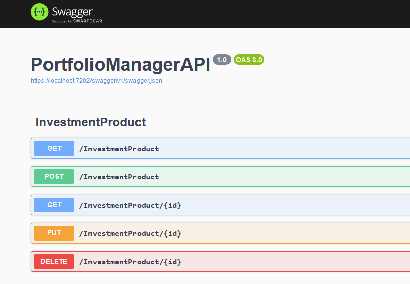
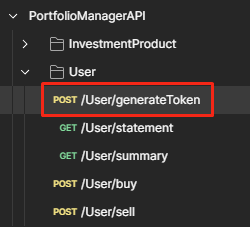
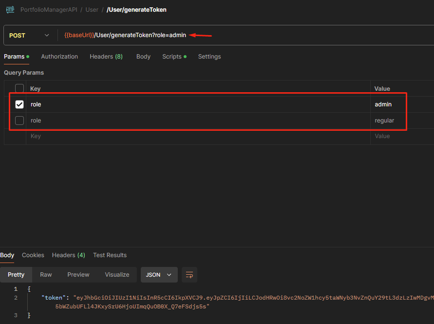
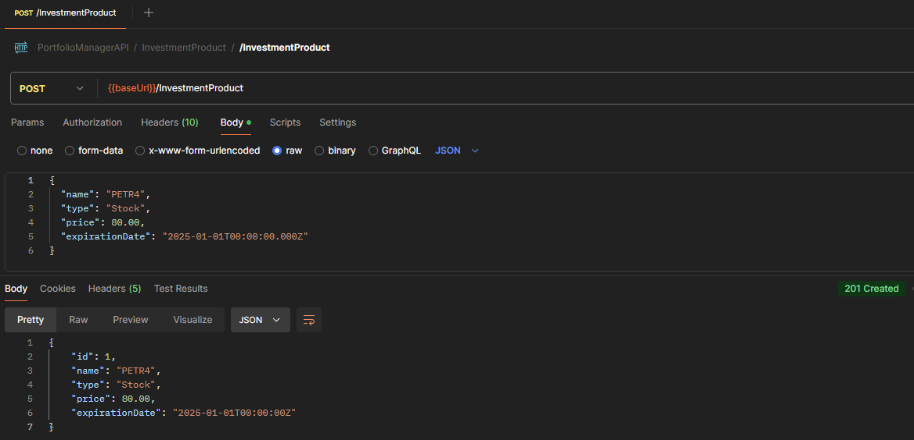
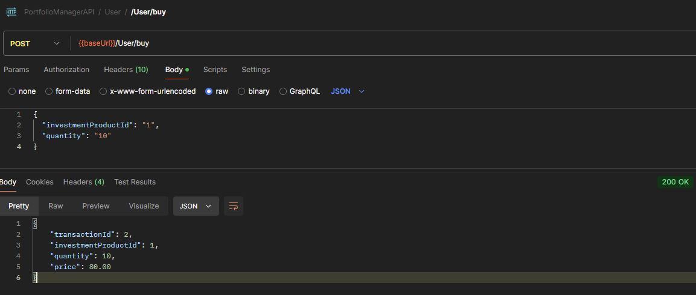
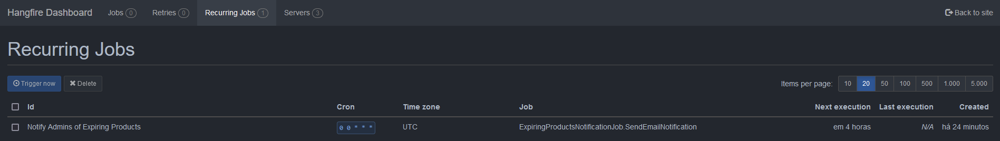
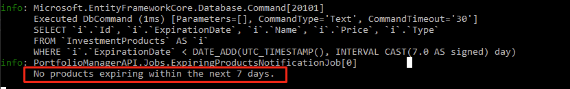
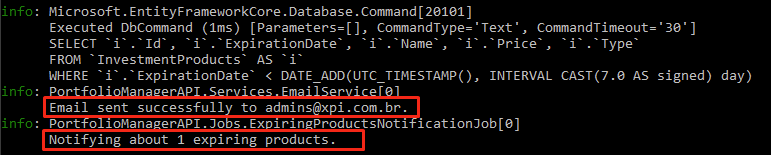

# Portfolio Manager API

O sistema descrito a seguir foi desenvolvido como parte do teste de processo seletivo para a vaga de Engenheiro de Software para a empresa XP Investimentos.

# Como Rodar o Projeto

## Pré-Requisitos

Os seguintes softwares devem ser instalados em sua máquina:

- [.NET SDK 8](https://dotnet.microsoft.com/download)
- [Docker](https://www.docker.com/products/docker-desktop)
- [Git](https://git-scm.com/downloads)
- [Postman](https://www.postman.com/downloads)

Além disso, certifique-se de que o `docker-compose` está instalado. Verifique a instalação com o comando:

```bash
docker-compose -v
```

## 1. Clonar o Repositório

Clone o repositório para sua máquina local:

```bash
git clone https://github.com/L968/PortfolioManagerAPI.git
```

## 2. Subir containers no docker

Navegue até a pasta raiz da solução e execute o seguinte comando:

```bash
docker-compose up -d
```

Esse comando irá subir os containers do `MySQL` e `Redis`, e também construirá a imagem da API. **A API, no entanto, será inicializada desligada** para não atrapalhar testes realizados no Visual Studio.

## 3. Executar as migrations

Abra o `Package Manager Console` do Visual Studio e execute as migrations com o comando:

```bash
update-database
```
## 4. Execute o projeto

Após as migrations, você pode executar o projeto no Visual Studio ou diretamente com o Docker.



# Como utilizar o projeto

É recomendável utilizar o Postman para realizar as requisições. O arquivo da collection do Postman foi enviado junto a este documento.

## Autenticação e Autorização

Todas as rotas exigem um token **JWT** para garantir a autenticação e autorização com base no perfil (role). Foram criadas duas roles no sistema:

- Admin
- Regular

Para gerar o token de cada um, utilize a rota `POST User/GenerateToken`, e escolha qual perfil deseja. **Não foi usada nenhuma lógica de login/senha ou criação de usuários por estar fora do escopo.**





- Rotas com perfil `regular`: Todas as rotas no controller `User`.
- Rotas com perfil `admin`: Todas as rotas no controller `InvestmentProduct`, exceto a listagem de produtos em `GET /InvestmentProduct`.

O token gerado será automaticamente salvo pelo Postman para ser reutilizado em outras requisições.

## Criando um produto de investimento

Dentro do controller `InvestmentProduct`, e com o token de admin gerado, execute a seguinte requisição. Dentro desse controller, temos todas as operações básicas de um CRUD.



Existem 2 Types:

- Stock
- Fund

Porém eles não têm valor lógico no código, e são apenas para questões de apresentação.

## Comprando/Vendendo um produto de investimento

Depois de criar o produto, gere o token com a role `regular`, e execute a seguinte requisição para comprar um produto de investimento. Lembre-se de informar o `InvestmentProductId` que foi criado anteriormente.
A mesma lógica se aplica à venda.




# Job de envio de email

Este projeto utiliza a biblioteca `Hangfire` para agendamento de jobs. Para monitorar o status da job, execute a aplicação e acesse a página:

https://localhost:7202/hangfire

Na aba `Recurring Jobs`, você poderá visualizar a job que foi configurada para rodar **uma vez ao dia**. É possível forçar sua execução clicando no botão `Trigger now`.



A mesma foi configurada para rodar 1x no dia, porém é possível forçar sua execução no botão `Trigger now`.
A nível de código, **a job não envia email na prática por se tratar de um teste**, além de que teríamos complicações com configurações de SMTP, etc.
Para conferir se a job rodou de fato, confira o log da aplicação:

Mensagem se não houver nenhum produto próximo de expirar:


Mensagem se houver produtos próximos de expirar:

